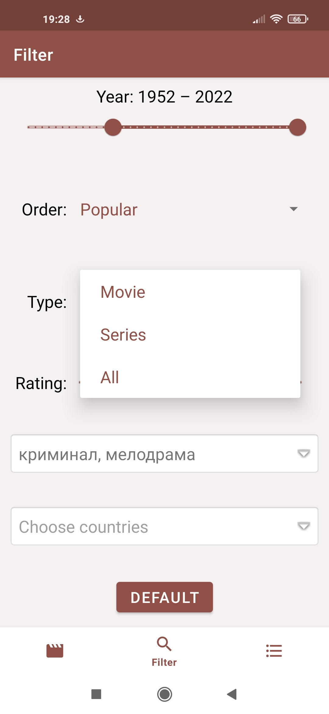
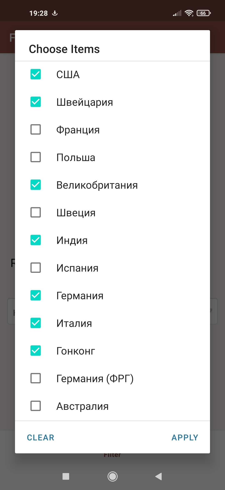

# Random Movie 
Приложение создано для любителей кино, которые хотят пополнить свою фильмографию интересными, но не особо популярными фильмами, или же пройтись по известной классики кинематографа.  
Всё зависит от настройки фильтров поиска, которая позволяет искать по определенным жанрам, годам, диапазону рейтинга. Если пользователю нравятся, например, индийские фильмы, он может искать фильмы конкретно по Индии. Приложение не ограничивается только фильмами, можно искать и сериалы.  
Случайные фильмы можно оценивать по 10-балльной шкале или добавить в список "Буду смотреть". Списки отмеченных фильмов можно редактировать, сортировать. 
 
[ Get APK](/description/random-movie.apk)

Features
------------
<b>1) Get a random movie by filter, with the ability to add it to the list.</b> 
   
<b>2) See more information about movie with redirect to IMDb and Kinopoisk links.</b> 
   
<b>3) Customize the filter by different parameters, such as countries, genres, year e.t.c.</b> 
   
<b>4) View and sort the list of marked movies.</b> 
   

Work with
---------------
* Clean Architecture, MVVM
* Kotlin Coroutines
* Kotlin Flows (dynamic list update, dynamic color palette changing)
* Retrofit/OkHttp (work with [Kinopoisk Api Unofficial](https://kinopoiskapiunofficial.tech/))
* Glide (load photos by URL, dynamic color palette changing)
* Room (data caching)
* Single Activity
* Jetpack Navigation
* Palette (get colors from photo)
